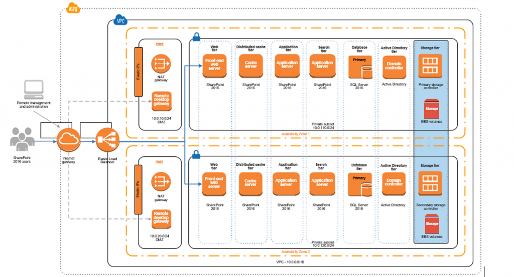

利用适用于Microsoft的AWS Marketplace合作伙伴存储解决方案

设计适合传统企业软件（如Microsoft SharePoint）的云存储解决方案可能具有挑战性。Microsoft SharePoint非常复杂，需要大量用于其众多数据库和内容存储库的基础存储。为确保选定的存储平台能够满足Microsoft推荐的可用性，连接性和性能要求，您需要使用基于并扩展AWS存储服务的功能和性能的第三方存储解决方案。

适用于Microsoft SharePoint的适当存储解决方案需要提供数据冗余，高可用性，容错，强大的加密，标准连接协议，时间点数据恢复，压缩，易于管理，目录集成和支持

["AWS Marketplace"](https://aws.amazon.com/marketplace/),作为采购渠道的独特定位，可以找到第三方存储产品，提供基于AWS存储服务的附加技术。第三方存储产品由行业新手提供并由云计算解决方案以及现有行业领导者进行维护。它们包括许多在企业中已经很熟悉和普遍部署的主流存储产品。

我们最近发布了“利用适用于Microsoft SharePoint的AWS Marketplace存储解决方案” ["白皮书"](https://d1.awsstatic.com/whitepapers/marketplace-storage-softnas-sharepoint.pdf)，来介绍部署和配置SoftNAS Cloud NAS，这是一种AWS Marketplace第三方存储产品，可提供安全，高度可用，冗余和容错存储Microsoft SharePoint协作套件。
