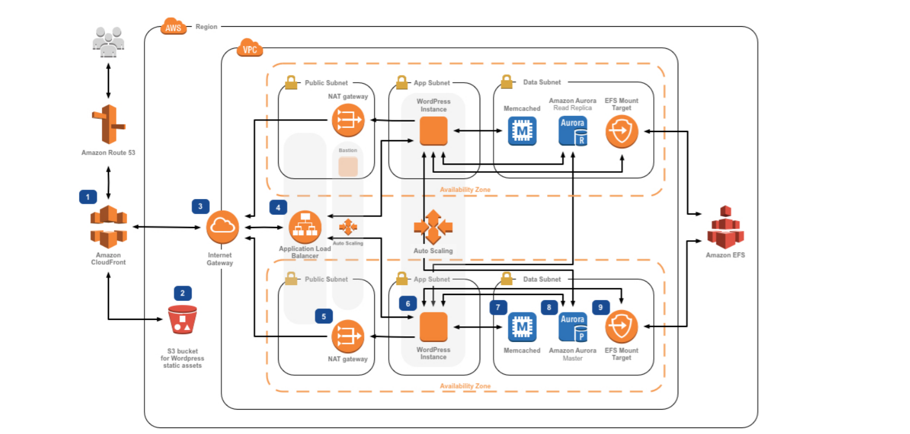

WordPress：AWS上的最佳实践

正如大多数人已经知道的那样，WordPress是一个流行的基于PHP和MySQL的开源博客平台和内容管理系统（CMS）。AWS客户部署从简单的博客到高流量，复杂的网站。

我们最近更新了[“WordPress: Best Practices on AWS”](https://d1.awsstatic.com/whitepapers/wordpress-best-practices-on-aws.pdf),白皮书，以结合新的AWS服务以及最新的最佳实践和思想。在更新后的白皮书中，我们将介绍如何使用单台服务器创建简单的部署，这对于那些新开发WordPress的人来说是一个很好的起点，或者那些正在寻找开发和测试环境的经济高效解决方案的人。

我们还着眼于将典型的WordPress网站的各个组件分离出来，以提高性能，弹性和成本效率，最终形成一个高度可用，多服务器，可伸缩的体系结构，如下图所示。 白皮书中概述的弹性部署与在AWS上部署WordPress 的参考架构密切相关，该架构可在[GitHub](https://github.com/awslabs/aws-refarch-wordpress)上获得。

Translate From：https://aws.amazon.com/cn/blogs/architecture/wordpress-best-practices-on-aws/
